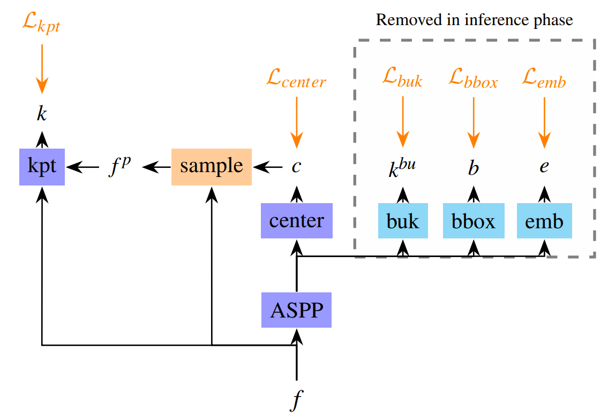
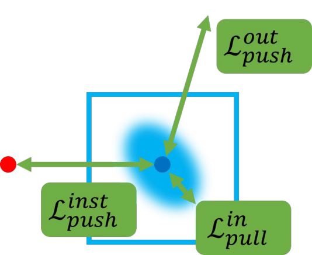

# BoIR: Box-Supervised Instance Representation for Multi-Person Pose Estimation

[[`Paper`](https://arxiv.org/pdf/2309.14072.pdf)]

BMVC 2023

<p float="left">
    
    
</p>

BoIR is a new multi-person pose estimation method that adeptly addresses the challenges of instance disentanglement and instance detection simultaneously, without incurring any additional computational costs during inference.
* Bbox Mask Loss effectively disentangles features by instances in the embedding space using a new embedding loss with spatially rich bounding box level supervision.
* Auxiliary task heads enrich instance representation by sharing multiple aspects of the instance, while no additional computational cost is induced during inference.

## Installation

### 1. Clone code

### 2. Create a conda environment for this repo
```shell
    conda create -n boir python=3.9.12
    conda activate boir
```
### 3. Install cuda toolkit 11.3
### 4. Install PyTorch 1.12.1 following official instruction, *e.g.*,
```shell
    pip3 install torch==1.12.1+cu113 torchvision==0.13.1+cu113 --extra-index-url https://download.pytorch.org/whl/cu113
```

### 5. Install other dependency python packages
```shell
    pip install -r requirements.txt
```
CrowdPose setup:
```shell
CrowdPoseAPI=/path/to/clone/CrowdPoseapi
git clone https://github.com/Jeff-sjtu/CrowdPose.git $CrowdPoseAPI # if python version is 3.8 or lower
git clone https://github.com/uyoung-jeong/CrowdPose.git $CrowdPoseAPI # if python version is 3.9
cd $CrowdPoseAPI/crowdpose-api/PythonAPI
python3 setup.py install --user # old
```
Original crowdposeapi may fail to build if python version is 3.9

### 6. Prepare dataset
Download [COCO ](https://cocodataset.org/#home), [CrowdPose](https://github.com/Jeff-sjtu/CrowdPose) and [OCHuman](https://github.com/liruilong940607/OCHumanApi) from website and put the zip file under the directory following below structure, (xxx.json) denotes their original name.

```
./data
|── coco
│   └── annotations
|   |   └──coco_train.json(person_keypoints_train2017.json)
|   |   └──coco_val.json(person_keypoints_val2017.json)
|   |   └──coco_test.json(image_info_test-dev2017.json)
|   └── images
|   |   └──train2017
|   |   |   └──000000000009.jpg
|   |   └──val2017
|   |   |   └──000000000139.jpg
|   |   └──test2017
|   |   |   └──000000000001.jpg
├── crowdpose
│   └── annotations
|   |   └──crowdpose_trainval.json(refer to DEKR, link:https://github.com/HRNet/DEKR)
|   |   └──crowdpose_test.json
|   └── images
|   |   └──100000.jpg
├── ochuman
│   └── annotations
|   |   └──ochuman_val.json(ochuman_coco_format_val_range_0.00_1.00.json)
|   |   └──ochuman_test.json(ochuman_coco_format_test_range_0.00_1.00.json)
|   └── images
|   |   └──000001.jpg
```
## Usage

### 1. Download trained model
* [link](https://drive.google.com/drive/folders/1bVfY1itT3qRJtbbCHdoZjpFxxro5Rlt1?usp=sharing)

Follow below model directory structure.

```
./model
|── imagenet
│   └── hrnet_w32-36af842e.pth
│   └── hrnetv2_w48_imagenet_pretrained.pth
├── coco
│   └── w32.pth.tar
│   └── w48.pth.tar
├── crowdpose
│   └── w32.pth.tar
│   └── w48.pth.tar
```

### 2. Evaluate Model
Change the checkpoint path by modifying `TEST.MODEL_FILE` option in *.yaml* or command line.

`--gpus` option specifies the gpu ids for evaluation, multiple ids denotes multiple gpu evaluation.

```python
# evaluate on coco val set with 2 gpus
python tools/valid.py --cfg experiments/coco_w32.yaml --gpus 0,1 TEST.MODEL_FILE model/coco/w32.pth.tar

# evaluate on coco test-dev set with 2 gpus (submit to codalab)
python tools/infer_coco_testdev.py --cfg experiments/coco_w32.yaml --gpus 0,1 TEST.MODEL_FILE model/coco/w32.pth.tar DATASET.TEST test

# evaluate on crowdpose test set with 2 gpus
python tools/valid.py --cfg experiments/crowdpose_w32.yaml --gpus 0,1 TEST.MODEL_FILE model/crowdpose/w32.pth.tar

# evaluate on ochuman test set with 2 gpus (trained on coco train set)
python tools/valid.py --cfg experiments/ochuman_w32.yaml --gpus 0,1 TEST.MODEL_FILE model/coco/w32.pth.tar

# evaluate on ochuman val set with 2 gpus (trained on coco train set)
python tools/valid.py --cfg experiments/ochuman_w32.yaml --gpus 0,1 TEST.MODEL_FILE model/coco/w32.pth.tar DATASET.TEST val
```

### 3. Train Model

You need to download imagenet pretrained HRNet models (see above) and change the checkpoint path by modifying `MODEL.PRETRAINED` in .yaml, and run following commands:
```python
# train on coco with 4 gpus
python tools/train.py --cfg experiments/boir/coco_w32.yaml --gpus 0,1,2,3

# train on crowdpose with 4 gpus
python tools/train.py --cfg experiments/boir/crowdpose_w32.yaml --gpus 0,1,2,3

# finetune on crowdpose with 4 gpus
python tools/train.py --cfg experiments/boir/crowdpose_w32.yaml --gpus 0,1,2,3 TEST.MODEL_FILE model/coco/checkpoint_w32.pth.tar TRAIN.TRANSFER_DATASET True
```

To continue training:
```python
python tools/train.py --cfg experiments/boir/coco_w32.yaml --gpus 0,1 --output_dir {path}
```

Training script will be added later.

## Main Results
### Results on COCO val and test-dev set
| Method| Test set | Backbone | Input size |     AP | AP.5 | AP .75 | AP (M) | AP (L) |
|----------|----------|----------|------------|-------|-------|--------|--------|--------|
| CID| COCO val | HRNet-W32  | 512            | 69.8  | 88.5  |  76.6  |  64.0  |  78.9  |
| CID| COCO test-dev | HRNet-W32  | 512       | 69.1  | 89.9  |  76.3  |  63.4  |  77.6  |     
| BoIR| COCO val | HRNet-W32  | 512           | 70.6  | 89.2  |  77.4  |  65.1  |  79.0  |
| BoIR| COCO val | HRNet-W48  | 640           | 72.5  | 89.9  |  79.1  |  68.2  |  79.4  |
| BoIR| COCO test-dev | HRNet-W32  | 512      | 69.5  | 90.4  |  76.9  |  64.2  |  77.3  |   
| BoIR| COCO test-dev | HRNet-W48  | 640      | 71.2  | 90.8  |  78.6  |  67.0  |  77.6  |

### Results on CrowdPose test set
| Method| Backbone | Input size |     AP | AP .5 | AP .75 | AP (E) | AP (M) | AP (H) |
|----------|----------|------------|-------|-------|--------|--------|--------| --------|
| CID| HRNet-W32  | 512            | 71.2  | 89.8  | 76.7   | 77.9   | 71.9   | 63.8  |
| CID| HRNet-W48  | 640            | 72.3  | 90.8  | 77.9   | 78.7   | 73.0   | 64.8  |
| CID(finetune)| HRNet-W32  | 512  | 74.9  | 91.8  | 81.0   | 82.0   | 75.8   | 66.3  |
| BoIR| HRNet-W32  | 512           | 70.6  | 89.9  | 76.5   | 77.1   | 71.2   | 63.0  |
| BoIR| HRNet-W48  | 640           | 71.2  | 90.3  | 76.7   | 77.8   | 71.8   | 63.5  |
| BoIR(finetune)| HRNet-W32  | 512 | 75.8  | 92.2  | 82.3   | 82.3   | 76.5   | 67.5  |
| BoIR(finetune)| HRNet-W48  | 640 | 77.2  | 92.4  | 83.5   | 82.7   | 78.1   | 69.8  |

### Results on OCHuman dataset
| Method| Train set | Test set | Backbone | Input size |     AP | AP.5 | AP .75 |     AR |
|----------|----------|----------|------------|-------|-------|--------|--------|--------|
| CID| COCO train | OCHuman val | HRNet-W32  | 512     | 45.7  | 58.8  |  51.1  |  78.3  |
| CID| COCO train | OCHuman test | HRNet-W32  | 512    | 44.6  | 57.5  |  49.3  |  78.0  |
| BoIR| COCO train | OCHuman val | HRNet-W32  | 512    | 47.4  | 60.0  |  52.6  |  80.1  |
| BoIR| COCO train | OCHuman val | HRNet-W48  | 640    | 49.4  | 62.3  |  54.9  |  80.8  |
| BoIR| COCO train | OCHuman test | HRNet-W32  | 512   | 47.0  | 59.7  |  52.3  |  80.3  |
| BoIR| COCO train | OCHuman test | HRNet-W48  | 640   | 48.5  | 61.3  |  54.1  |  80.7  |

## Citation


## Acknowledgement
Our code is derived from:
* [CID](https://github.com/kennethwdk/CID)
* [ConvNext](https://github.com/facebookresearch/ConvNeXt)
* [YOLOv6](https://github.com/meituan/YOLOv6)
* [timm](https://github.com/huggingface/pytorch-image-models/tree/main/timm)
